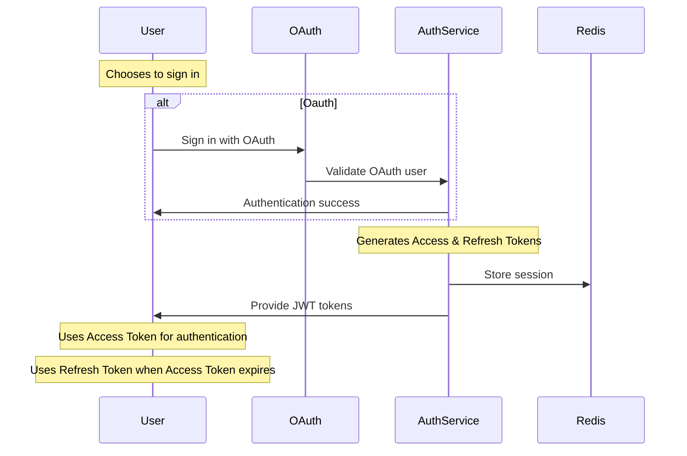

# User Service

Some auth diagram:

```mermaid
sequenceDiagram
    participant User
    participant OAuth
    participant AuthService
    participant Redis

    Note over User: Chooses to sign in
    alt Oauth
        User->>OAuth: Sign in with OAuth
        OAuth->>AuthService: Validate OAuth user
        AuthService->>User: Authentication success
    end

    Note over AuthService: Generates Access & Refresh Tokens
    AuthService->>Redis: Store session
    AuthService->>User: Provide JWT tokens

    Note over User: Uses Access Token for authentication
    Note over User: Uses Refresh Token when Access Token expires
```
